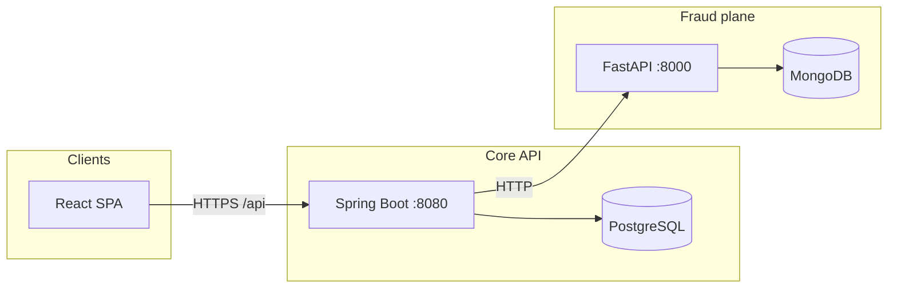

# FinGaurd

**FinGaurd** is a full-stack financial management platform with integrated fraud detection: users authenticate against a Spring Boot core service, manage transactions in PostgreSQL, and route high-risk activity through a Python FastAPI fraud service backed by MongoDB for analysis and audit trails. Infrastructure is defined as code (Terraform) and validated in CI (GitHub Actions).

---

## Table of contents

- [Why this exists](#why-this-exists)
- [System architecture](#system-architecture)
- [Technology choices](#technology-choices)
- [Repository layout](#repository-layout)
- [Prerequisites](#prerequisites)
- [Run locally](#run-locally)
- [Development workflow](#development-workflow)
- [Configuration](#configuration)
- [APIs and documentation](#apis-and-documentation)
- [CI/CD](#cicd)
- [Security notes](#security-notes)
- [Roadmap status](#roadmap-status)
- [License](#license)

---

## Why this exists

The project demonstrates end-to-end ownership of a **multi-service product**: relational data and business rules in Java, ML-assisted anomaly scoring in Python, a React SPA for operators, and cloud-ready packaging (Docker, Terraform, CI). It is suitable as a portfolio piece or as a baseline to fork for regulated fintech experiments.

**Core capabilities**

| Area | What you get |
|------|----------------|
| Identity | Signup, login, JWT access + refresh, profile updates, account lockout after failed attempts |
| Money | CRUD transactions, filters, pagination, stats, category analytics, fraud-flagged views |
| Fraud | Rule + model-based scoring, audit persistence, health endpoints for orchestration |
| Ops | Compose for local stacks, Terraform for AWS-shaped environments, GitHub Actions for build quality |

---

## System architecture

Clients hit the **React** app (Vite dev server or static container). The UI talks to the **Java API** (`/api/*`) which owns users and transactions in **PostgreSQL**. For fraud scoring and audit, the Java service calls the **Python** service; **MongoDB** stores fraud analysis and audit payloads.



For a deeper design narrative, see [ARCHITECTURE.md](./ARCHITECTURE.md).

---

## Technology choices

| Layer | Stack |
|-------|--------|
| Web UI | React 19, Vite 7, Tailwind CSS 4, React Router, Recharts |
| Core API | Java 21, Spring Boot 3, Spring Security, JWT, Spring Data JPA |
| Fraud API | Python 3.11+, FastAPI, scikit-learn (Isolation Forest), Pydantic |
| Data | PostgreSQL 15 (users, transactions), MongoDB 7 (fraud/audit documents) |
| Infra | Docker, Docker Compose, Terraform (VPC, RDS, ECS, ALB, etc.) |
| Quality gates | Maven tests, pytest, Ruff, ESLint, GitHub Actions |

---

## Repository layout

```
FinGaurd/
├── .github/workflows/     # CI (build, test, lint) and deploy workflows
├── docs/                  # API reference, Postman collection, deployment guides
├── frontend/              # React SPA (Vite + Tailwind)
├── java-service/          # Spring Boot core API
├── python-fraud-service/  # FastAPI fraud detection + MongoDB client
├── terraform/             # AWS-style modules and environment tfvars
├── compose.yaml           # Local multi-service stack (recommended entry point)
├── ARCHITECTURE.md
├── SETUP.md
└── README.md              # This file
```

Service-specific READMEs live under `java-service/`, `python-fraud-service/`, `frontend/`, and `terraform/`.

---

## Prerequisites

- **Docker** and **Docker Compose** (recommended path), or
- **Java 21** + **Maven 3.9+**, **Node.js 20+**, **Python 3.11+**, and local PostgreSQL + MongoDB if you run services without Compose.

---

## Run locally

### Option A: Docker Compose (recommended)

From the repository root:

```bash
docker compose up -d
```

Typical ports (see `compose.yaml` for exact mapping):

| Service | Port |
|---------|------|
| Java API | 8080 |
| Python fraud API | 8000 |
| PostgreSQL | 5432 |
| MongoDB | 27017 |

The frontend can be run against the Java API via Vite proxy (see `frontend/vite.config.js`) or included in Compose if your profile defines it.

### Option B: Manual / hybrid

Step-by-step environment setup, profiles, and database initialization are documented in [SETUP.md](./SETUP.md).

---

## Development workflow

1. **Branch from `main`** for feature work; keep commits focused and message them clearly.
2. **Java**: `cd java-service && mvn -B test` (uses test profile / H2 as configured).
3. **Python**: `cd python-fraud-service && pip install -r requirements.txt && ruff check app/ && pytest`.
4. **Frontend**: `cd frontend && npm ci && npm run build && npm run lint`.
5. **Integration**: Exercise the stack via Compose and the Postman collection under `docs/postman/`.

---

## Configuration

- **Java**: `application.yml` / env vars for datasource, JWT secret, and **`FRAUD_SERVICE_URL`** (must point at the Python service from Docker or k8s — e.g. `http://python-fraud-service:8000` in Compose — otherwise the default `localhost:8000` only works on a single host).
- **Python**: Pydantic settings (`app/core/config.py`) — MongoDB URI, model paths, thresholds.
- **Frontend**: `VITE_*` if used; dev server proxies `/api` to the backend (see Vite config).

Never commit production secrets. Replace Compose defaults (`changeme`, placeholder JWT secrets) before any real deployment.

---

## APIs and documentation

- [docs/api/API_REFERENCE.md](./docs/api/API_REFERENCE.md) — endpoint-oriented reference.
- [docs/deployment/DEPLOYMENT_GUIDE.md](./docs/deployment/DEPLOYMENT_GUIDE.md) — deployment patterns.
- `docs/postman/FinGaurd.postman_collection.json` — runnable requests.

---

## CI/CD

- **`.github/workflows/ci.yml`**: JDK 21 + Maven for the Java service; Python 3.11 + Ruff + pytest for the fraud service; Docker image builds after both succeed.
- **`.github/workflows/deploy.yml`**: Image build/push and deployment hooks (e.g. Render) as configured in your fork.

Align local JDK with CI (`21`) to avoid compiler or bytecode mismatches.

---

## Security notes

- JWT signing keys and database passwords must be rotated for non-local use.
- The fraud and core services should sit behind TLS and network policies in production.
- Account lockout and refresh-token flows are implemented in the Java service; review session expiry and refresh policies for your threat model.

---

## Roadmap status

Phases **0–5** (design, local services, containerization, Terraform, CI/CD, documentation) are implemented in this repository. Treat cloud costs and compliance (PCI, SOC2, etc.) as **out of scope** unless you extend the design explicitly.

---

## License

This project is maintained for learning and demonstration. Fork and adapt under terms that fit your use case; there is no warranty implied.

---

**Maintainer:** [preethamdandu](https://github.com/preethamdandu) · **Repository:** [FinGaurd](https://github.com/preethamdandu/FinGaurd)
